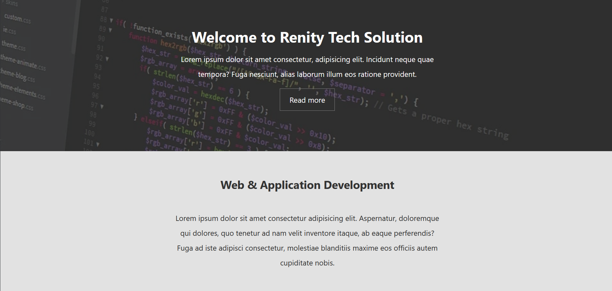
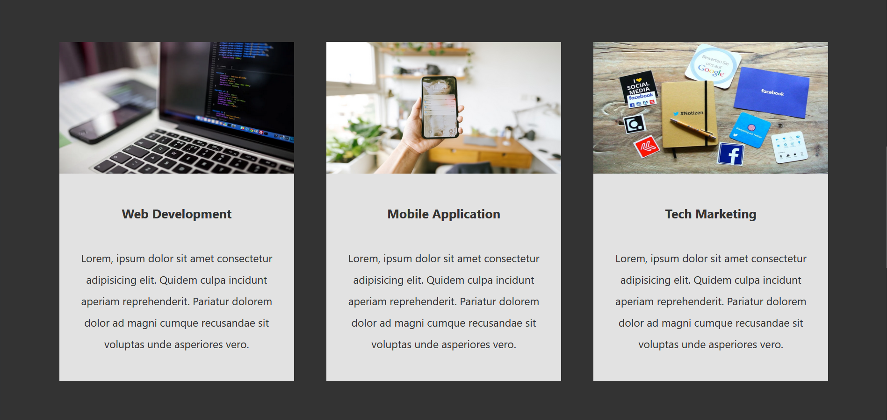
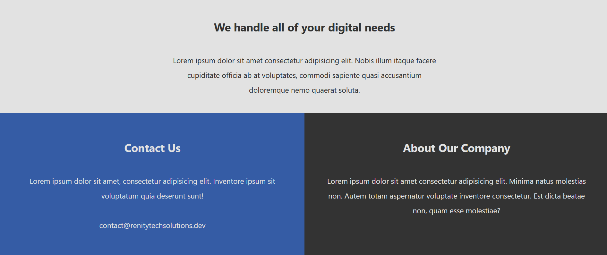

# CSS Grid 🔢🖌️       


         

        

         


This website was created as a practice for me to enhance my CSS knowledge, especially in CSS Grid. My notes for learning CSS Grid is at `/notes` folder, and this website is a practical way to implement CSS Grid. This Renity Tech Solution is like basic business landing page.        


Thanks to the [Brad Traversy](https://github.com/bradtraversy) to guide this tutorial, which is I was followed along the [Grid CSS Responsive Website Layout](https://www.youtube.com/watch?v=M3qBpPw77qo) on his YouTube channel.              


This website was built on top of Vite.          

To test this website locally, you need to have [Node.js](https://nodejs.org/en/) installed on your local machine. Then, kindly download the zip file of the source code. After extract the folder, open the terminal and type

```Shell
	npm install
	// This will install all the dependencies of the project
```


To run the website in development mode, type 

```Shell
	npm run dev
```

To build the original source code into JavaScript bundle, type

```Shell
	npm run build
```

To run this website in distribution/preview mode, type

```Shell
	npm run preview
```      
